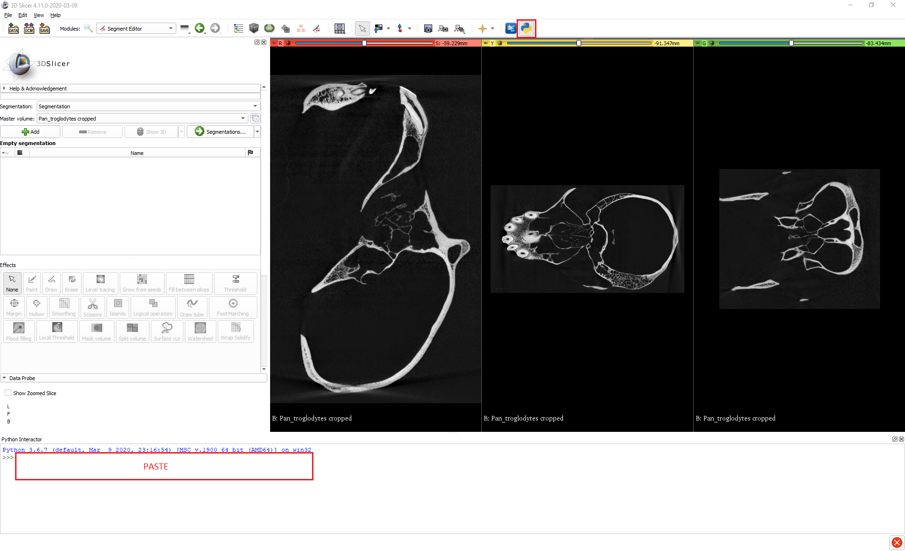
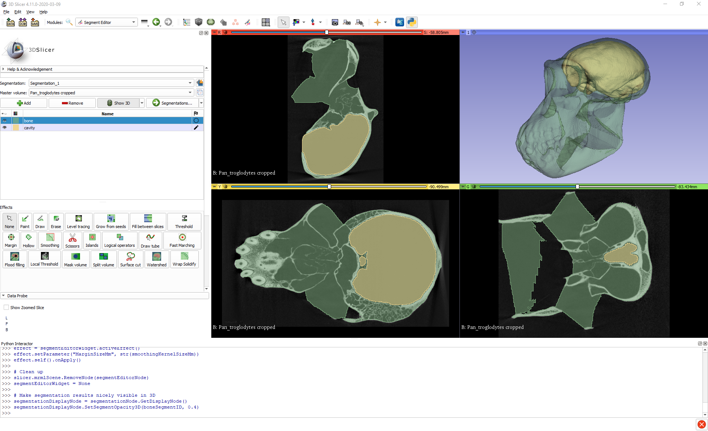
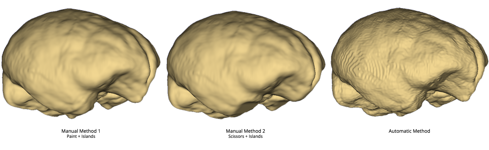

# Cavity Segmentation: Creating Endocasts
### By Max Kerney

Usually we’re interested in segmenting particular anatomical structures, such as an organ or bone, so that we can visualise or analyse them, but in some cases we need to be able to visualise or analyse the space within or between structures  i.e. cavities. A classic example of this in evolutionary biology is recovering the size and shape of an animal’s brain from their cranial cavity.

In this tutorial I’ll demonstrate how cavity segmentation can be done in 3D Slicer, using the creation of an endocast from a skull as an example. The selection of tools available in 3D Slicer means that any task in it can typically be achieved in multiple ways, and here I’ll show you three different methods for creating an endocast – two manual and one automatic – to give you different options and ideas for how to go about cavity segmentation that you can select from or adapt for your own needs.

If you’d like to follow along you can download the microCT data on the chimpanzee skull I’ll be using from MorphoSource at this link: https://www.morphosource.org/index.php/Detail/MediaDetail/Show/media_file_id/4390. If you do download the DICOM file, you’ll first need to patch it using the DICOM Patcher module before you’ll be able to load it into 3D Slicer. You can find instructions on how to do that here: https://blogs.uw.edu/maga/2017/04/morphosource-data-and-dealing-with-dicom-series-in-slicer/.

The scan is much higher resolution than what we need for this task, so to speed up all the operations you may also want to downsample the data using the Crop Volume module. You can find instructions on how to do that in Section 5 of this tutorial: https://blogs.uw.edu/maga/2017/04/a-worked-example-getting-and-visualizing-data-from-digimorph/. I used 4.00x scaling, which works well.

## Manual Methods 
Both manual methods have initial steps in common, which involve isolating the cavity of interest so that it can then be segmented. Here, that means isolating the cranial cavity within the skull.

1.	Create a segment for the skull.

       1.1.	Open the **Segment Editor**.
       
       1.2.	Make sure the correct Master volume is selected.
       
       1.3.	Add a new segment for the skull.
       
       1.4.	Create the skull segment using thresholding. This is most easily done in this example by using automatic thresholding. In the *Threshold* tool, go to *Automatic threshold* and click *Set* then *Apply*. You could instead set the *Threshold Range* manually if you wanted more control.

2.	Plug small openings in the skull segment, such as the naturally occurring foramina or holes due to damage to the specimen. (We can ignore the foramen magnum for now).

       2.1.	With the *Margin* tool, apply a *Grow* operation to the skull segment. The default 3.0mm works well in this example for inflating the segment enough to close any small openings there may be, though in other cases you may have to adjust this value. You can have a quick scroll through the slice views to check that there are no remaining small openings leading out of the cranial cavity.

Now that the skull segment is prepared in this way and the cranial cavity is (largely) isolated, the two manual methods differ in how they go about segmenting the cavity itself.

## Method 1: Paint + Islands

1.	Paint over the foramen magnum to plug it and fully isolate the cranial cavity.

       1.1.	Align one of the slice views so that you can see the foramen magnum.
       
       1.2.	Enable *Slice intersections* by opening the dropdown menu next to the *Crosshairs* button at the top centre of the UI and clicking *Slice intersections* at the bottom of the menu.
       
       1.3.	Holding *Shift*, move your mouse around on your chosen axial slice view to position the crosshairs on the foramen magnum. Hold *Ctrl/Cmd + Alt* and *click + drag* the mouse to rotate the crosshairs so that they nicely span the opening. All the slice views should now be coordinated to show the same section of the foramen magnum.

       1.4.	Select the *Paint* tool, and a suitably large brush diameter, and go to the slice view that allows you to see the whole foramen magnum and *click + drag* to completely paint over the opening.

2.	Add a new segment for the endocast.

3.	Create the endocast segment using the *Islands* tool.

       3.1.	Under the Islands tool, select Add selected island.
       
       3.2.	In any of the slice views, click anywhere inside the cranial cavity. If it was successfully isolated, then the cranial cavity should indeed be an island and will be segmented. If this doesn’t work, doublecheck that there are no leftover openings. 

4.	Adjust the endocast segment to account for the inflated skull segment from the preparatory steps.

       4.1.	With the Margin tool, Grow the endocast segment by 3.0mm (or by whatever amount you previously grew the skull segment by), so that it fills the original volume of the cranial cavity.

5.	Depending on exactly where you painted over the foramen magnum, the previous step may lead to the endocast segment growing out of the skull a bit, and if it does then you can trim it with the Scissors.

       5.1.	In the Scissors tool, select Erase inside, Free-form, and Unlimited.
       
       5.2.	Click + drag around the excess part of the endocast segment that you want to remove and release to delete it. You can make use of the straight edge between the start and end points of the scissors to get a neat cut. If you click on one side of the foramen magnum and then loop around to the other, the tool will create a straight line between the two points and if you release it then it will make a straight cut.

## Method 2: Scissors + Islands
1.	Add a new segment for the endocast.

2.	Create a block segment using the Scissors tool from which to carve out the endocast.

       2.1.	In the Scissors tool, select Fill inside, Free-form, and Unlimited.
       
       2.2.	In the Masking section, set Editable area to Outside all segments so that the skull segment isn’t overwritten.
       
       2.3.	Make sure you have a slice view set to show the largest cross-section of the cranial cavity.
       
       2.4.	Trace around the cranial cavity with the scissors, leaving a safe margin and taking care to cross the foramen magnum at a desirable point (again, you can use the straight edge of the scissors to help with this). This will create a roughly cranial cavity-shaped block that extends straight through the skull. (You can visualise this by clicking the Show 3D button).

3.	Trim the block using the Islands tool to create the endocast segment.

       3.1.	In the Islands tool, select Keep selected island.
       
       3.2.	In any of the slice views, click anywhere inside the cranial cavity. Again, if the cranial cavity was successfully isolated then it should be an island within the block segment we created, separated from the rest of the block by the cranial wall, and will be retained as the final segment while the extraneous parts of the block are removed.

4.	Follow steps 4 and 5 of Method 1 to adjust the endocast to fill the full volume of the cranial cavity and tidy up any overflow. Just remember when using the Margin tool to set the Editable area back to the default Everywhere

## Automatic Method

Two of the great advantages of 3D Slicer are its large collection of community-developed extensions and its accessible Python backend, and we can leverage both to fully automate segmentation of the cranial cavity. As is often the case though, with convenience comes compromise, and this automated method is limited to segmenting the largest cavity in a specimen, and it may also affect the surface appearance of segments. So if in your work you need to segment a particular cavity that is not the largest in a specimen, or you need to maintain the appearance of segments for visualisation purposes, then this may not be the method for you. However, it is well suited to our purposes here  the quick and accurate creation of an endocast.

1.	Install the SurfaceWrapSolidify extension using the Extension Manager. (SlicerMorph users: This packages comes bundled with SlicerMorph extension and/or the customized SlicerMorph application)

       1.1.	If you’re using 3D Slicer version 4.11 or higher you can go to the View menu at the top left and open the Extension Manager. (If you’re using an earlier version you’ll have to install the extension manually. See the extension’s page for guidance: https://github.com/sebastianandress/Slicer-SurfaceWrapSolidify). 
       
       1.2.	In the Install Extensions tab, search for “SurfaceWrapSolidify” and install.

2.	Make sure the volume you want to work with – in this case the cropped chimpanzee skull volume – is the only one in the scene.

3.	Open the Python Interactor window by clicking on the Python icon at the top right of the GUI.

4.	Go to this link https://gist.github.com/lassoan/4d0b94bda52d5b099432e424e03aa2b1  and copy all the code. (SlicerMorph Users this is now a module within SlicerMorph extension. We acknowledge Andras Lasso for his contribution)

5.	Paste the code into the Python Interactor window.

6.	Wait, probably for a few minutes depending on your computer. The code will output bone and cavity segments and present them in the 3D view.

If you look at the code, you can see that this script is doing the same general things that we did with the manual methods. It creates a segment for the skull through thresholding, plugs holes to isolate the cranial cavity, then targets and segments that cavity. The main difference is in how it plugs the holes. Rather than using margin growing or painting like the manual methods it uses functions in the SurfaceWrapSolidify extension to virtually “shrink wrap” the skull to cover over any holes. This shrink wrapping is what leads to the final surface appearance of the skull and endocast segments.

## Comparison of methods
As I said at the beginning, I have presented multiple methods here to give you different options and showcase different approaches that might give you ideas for how to tackle your own cavity segmentation tasks. All the methods produce similar results, though there is some variation between them that you might want to bear in mind when choosing which method to use depending on what you intend to use your final cavity segmentation for.

You can see that there are some slight visual differences between the endocasts produced, and there are also slight quantitative differences between them too. We can use the Segment Statistics module to find out the volumes of the endocasts created by the different methods, which in a research context could be taken as estimates of a specimen’s brain size. Manual Method 1 (Paint + Islands) produces a brain size estimate for our chimpanzee of 319.2 cm3; Manual Method 2 (Scissors + Islands) an estimate of 317.5 cm3; and the Automatic Method an estimate of 314.7 cm3. 

All these estimates fall right within the known natural variation of chimpanzee brain size, so we can be confident that all the methods produce valid results. Isler et al. (2008) gathered measurements of chimpanzee brain size the traditional way by filling the cranial cavities of museum specimens with seed, sand, or glass beads, and then converting the weight of these into volume measurements, and from a sample of 115 specimens arrived at a mean brain size for chimpanzees of 368 cm3, with a range from 282-480 cm3. However, although the results of all the methods are valid, the variation between them means that if you intend to use the methods for research you may want to do your own evaluations to see which of them produces the most reliable estimates for your purposes.

In fact, you can export these segmentations as 3D models, and use the `Surface to surface distance` extension to generate heatmaps of where the differences between the extracted surfaces are. 

**References**

Isler, K., Christopher Kirk, E., Miller, J.M.A., Albrecht, G.A., Gelvin, B.R., Martin, R.D., 2008. Endocranial volumes of primate species: scaling analyses using a comprehensive and reliable data set. Journal of Human Evolution 55, 967–978. https://doi.org/10/bxv9mr

