# Cavity Segmentation: Creating Endocasts
### By Max Kerney

Usually we’re interested in segmenting particular anatomical structures, such as an organ or bone, so that we can visualise or analyse them, but in some cases we need to be able to visualise or analyse the space within or between structures – i.e. cavities. A classic example of this in evolutionary biology is recovering the size and shape of an animal’s brain from their cranial cavity.

In this tutorial I’ll demonstrate how cavity segmentation can be done in 3D Slicer, using the creation of an endocast from a skull as an example. The selection of tools available in 3D Slicer means that any task in it can typically be achieved in multiple ways, and here I’ll show you three different methods for creating an endocast – two manual and one automatic – to give you different options and ideas for how to go about cavity segmentation that you can select from or adapt for your own needs.

If you’d like to follow along you can download the microCT data on the chimpanzee skull I’ll be using from MorphoSource at this link: https://www.morphosource.org/index.php/Detail/MediaDetail/Show/media_file_id/4390. If you do download the DICOM file, you’ll first need to patch it using the DICOM Patcher module before you’ll be able to load it into 3D Slicer. You can find instructions on how to do that here: https://blogs.uw.edu/maga/2017/04/morphosource-data-and-dealing-with-dicom-series-in-slicer/.

The scan is much higher resolution than what we need for this task, so to speed up all the operations you may also want to downsample the data using the Crop Volume module. You can find instructions on how to do that in Section 5 of this tutorial: https://blogs.uw.edu/maga/2017/04/a-worked-example-getting-and-visualizing-data-from-digimorph/. I used 4.00x scaling, which works well.

## Manual Methods 
Both manual methods have initial steps in common, which involve isolating the cavity of interest so that it can then be segmented. Here, that means isolating the cranial cavity within the skull.

1.	Create a segment for the skull.

       1.1.   Open the **Segment Editor**.
       
       1.2.	Make sure the correct *Master volume* is selected.
       
       1.3.	Add a new segment for the skull.
       
       1.4.	Create the skull segment using thresholding. This is most easily done in this example by using automatic thresholding. In the *Threshold* tool, go to *Automatic threshold* and click *Set* then *Apply*. You could instead set the *Threshold Range* manually if you wanted more control.

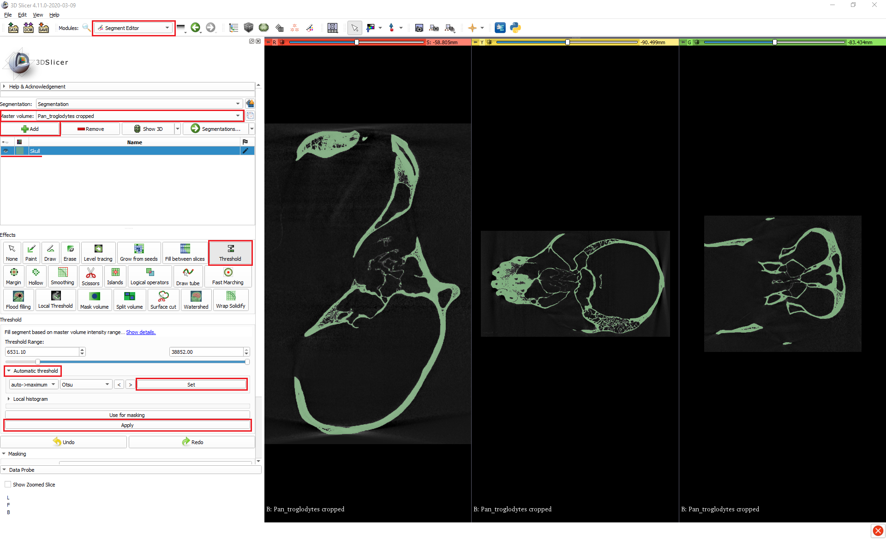

2.	Plug small openings in the skull segment, such as the naturally occurring foramina or holes due to damage to the specimen. (We can ignore the foramen magnum for now).

       2.1.	With the *Margin* tool, apply a *Grow* operation to the skull segment. The default 3.0mm works well in this example for inflating the segment enough to close any small openings there may be, though in other cases you may have to adjust this value. You can have a quick scroll through the slice views to check that there are no remaining small openings leading out of the cranial cavity.

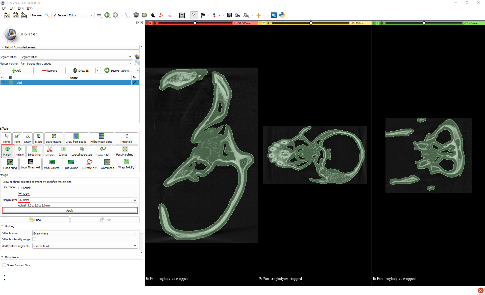

Now that the skull segment is prepared in this way and the cranial cavity is (largely) isolated, the two manual methods differ in how they go about segmenting the cavity itself.

## Method 1: Paint + Islands

1.	Paint over the foramen magnum to plug it and fully isolate the cranial cavity.

       1.1.	Align one of the slice views so that you can see the foramen magnum.
       
       1.2.	Enable *Slice intersections* by opening the dropdown menu next to the *Crosshairs* button at the top centre of the UI and clicking *Slice intersections* at the bottom of the menu.
       
       1.3.	Holding *Shift*, move your mouse around on your chosen slice view to position the crosshairs on the foramen magnum. Hold *Ctrl/Cmd + Alt* and *click + drag* the mouse to rotate the crosshairs so that they nicely span the opening. All the slice views should now be coordinated to show the same section of the foramen magnum.

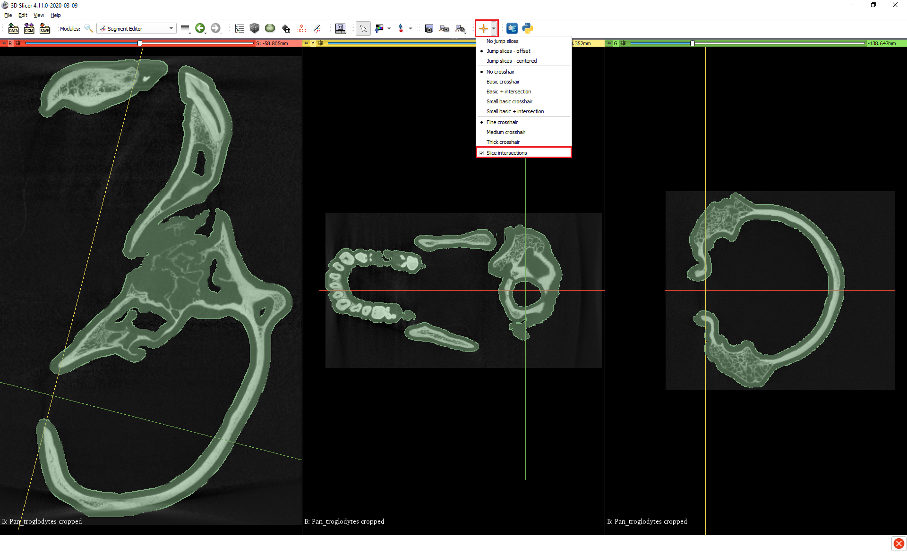

1.4.   Select the *Paint* tool, and a suitably large brush diameter, and go to the slice view that allows you to see the whole foramen magnum and *click + drag* to completely paint over the opening.

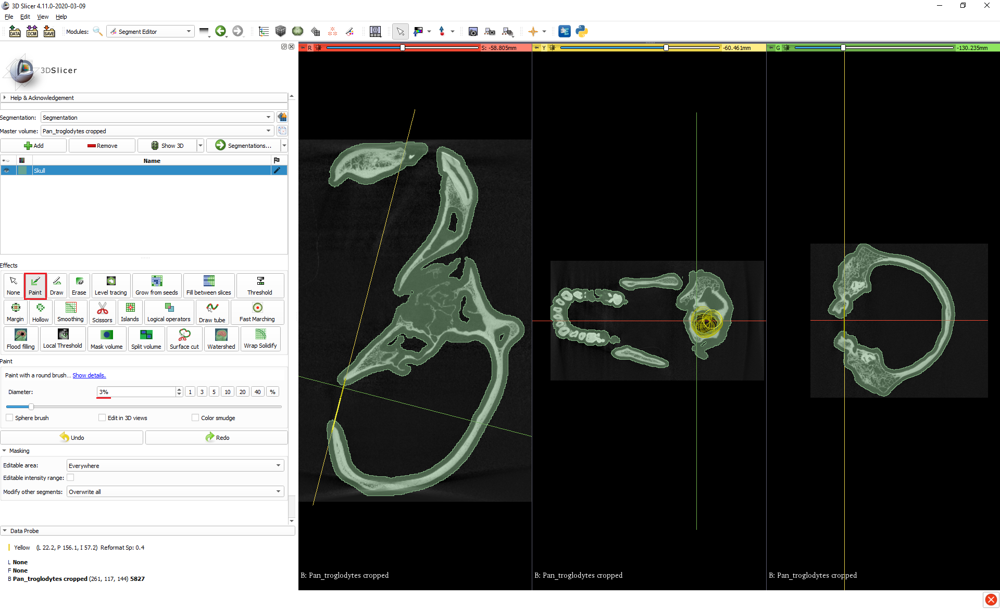

2.	Add a new segment for the endocast.

3.	Create the endocast segment using the *Islands* tool.

       3.1.	Under the *Islands* tool, select *Add selected island*.
       
       3.2.	In any of the slice views, click anywhere inside the cranial cavity. If it was successfully isolated, then the cranial cavity should indeed be an island and will be segmented. If this doesn’t work, doublecheck that there are no leftover openings. 

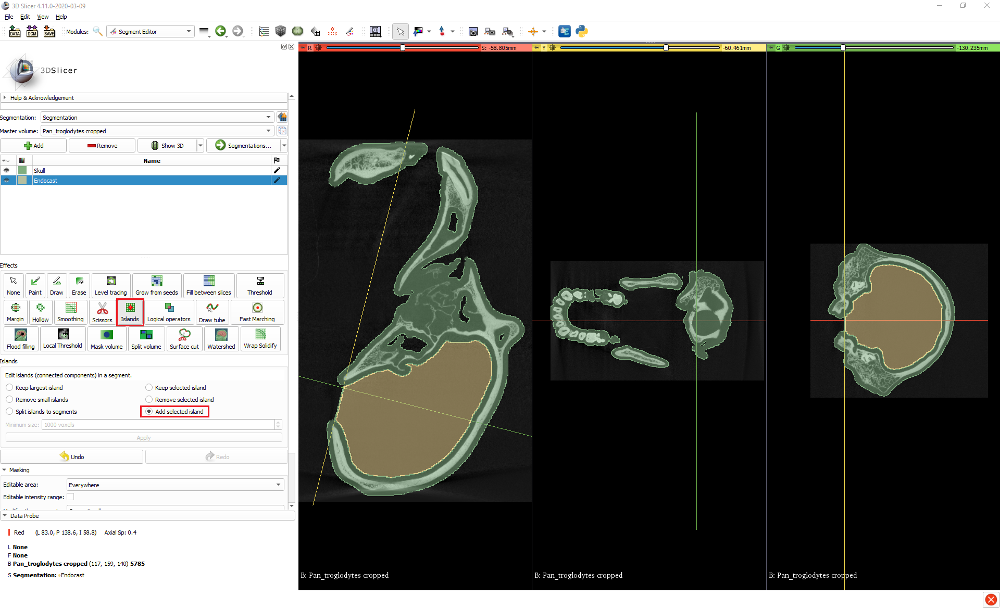

4.	Adjust the endocast segment to account for the inflated skull segment from the preparatory steps.

       4.1.	With the *Margin* tool, *Grow* the endocast segment by 3.0mm (or by whatever amount you previously grew the skull segment by), so that it fills the original volume of the cranial cavity.

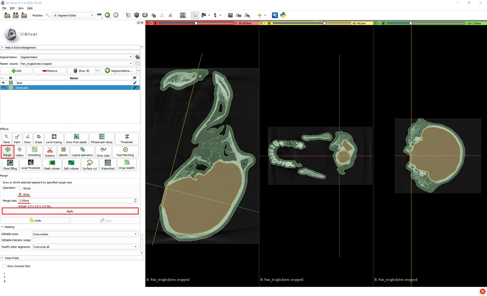

5.	Depending on exactly where you painted over the foramen magnum, the previous step may lead to the endocast segment growing out of the skull a bit, and if it does then you can trim it with the *Scissors*.

       5.1.	In the *Scissors* tool, select *Erase inside*, *Free-form*, and *Unlimited*.
       
       5.2.	*Click + drag* around the excess part of the endocast segment that you want to remove and release to delete it. You can make use of the straight edge between the start and end points of the scissors to get a neat cut. If you click on one side of the foramen magnum and then loop around to the other, the tool will create a straight line between the two points and if you release it then it will make a straight cut.

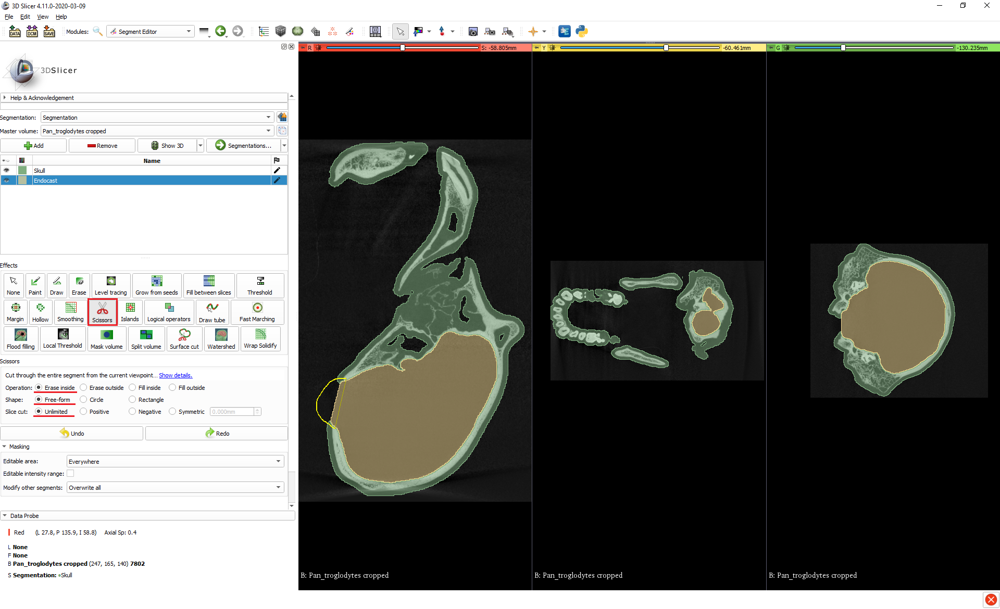

## Method 2: Scissors + Islands
1.	Add a new segment for the endocast.

2.	Create a block segment using the *Scissors* tool from which to carve out the endocast.

       2.1.	In the *Scissors* tool, select *Fill inside*, *Free-form*, and *Unlimited*.
       
       2.2.	In the *Masking* section, set *Editable area* to *Outside all segments* so that the skull segment isn’t overwritten.
       
       2.3.	Make sure you have a slice view set to show the largest cross-section of the cranial cavity.
       
       2.4.   Trace around the cranial cavity with the scissors, leaving a generous margin to ensure that the whole cranial cavity is covered and taking care to cross the foramen magnum at a desirable point (again, you can use the straight edge of the scissors to help with this). This will create a roughly cranial cavity-shaped block that extends straight through the skull. (You can visualise this by clicking the *Show 3D* button).

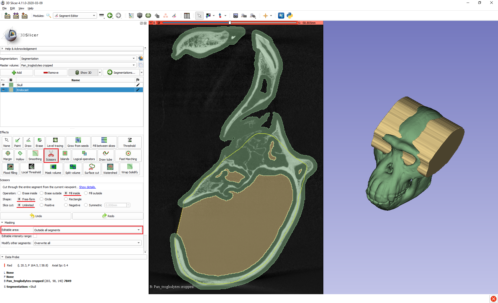

3.	Trim the block using the *Islands* tool to create the endocast segment.

       3.1.	In the *Islands* tool, select *Keep selected island*.
       
       3.2.	In any of the slice views, click anywhere inside the cranial cavity. Again, if the cranial cavity was successfully isolated then it should be an island within the block segment we created, separated from the rest of the block by the cranial wall, and will be retained as the final segment while the extraneous parts of the block are removed.
       
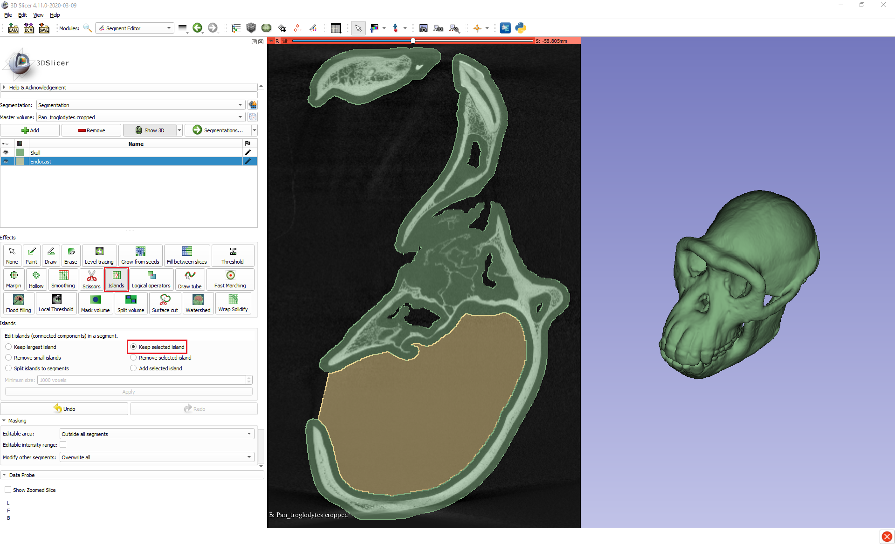

4.0     Follow steps 4 and 5 of Method 1 to adjust the endocast to fill the full volume of the cranial cavity and tidy up any overflow. Just remember when using the *Margin* tool to set the *Editable area* back to the default *Everywhere*, and when using the *Scissors* to set them back to *Erase inside*.

## Automatic Method
One of the great advantages of 3D Slicer is its large collection of community-developed extensions, and one such extension – **SlicerMorph** – provides a tool that fully automates the process of segmenting a cranial cavity to produce an endocast. **SlicerMorph** is available as an extension inside 3D Slicer versions 4.11 and higher or can be downloaded as a standalone application. Here I’m using the version inside 3D Slicer.

1.	Install the **SlicerMorph** extension.

       1.1.	Go to the *View* menu at the top left and open the **Extension Manager**.
       
       1.2.	In the *Install Extensions* tab, search for “SlicerMorph” and install.

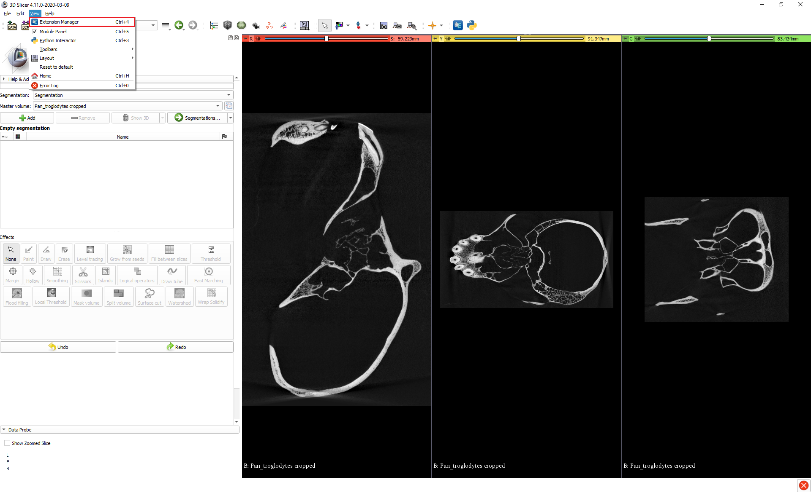

2.	Open **SlicerMorph**’s tool for automatically segmenting cranial cavities by going to the *Module dropdown menu* > *SlicerMorph* > *SlicerMorph Labs* > *Segment Endocranium*.

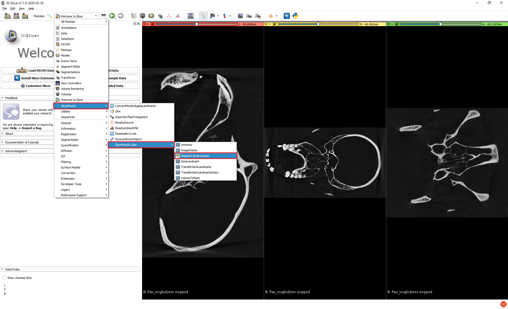

3.	Within the tool, specify the input volume and segment that you want to output to. The smoothing kernel size is equivalent to the margin size that we used in Step 2 of the preparatory phase of the manual methods to grow the skull segment by to plug small holes and isolate the cranial cavity. Again, the default 3.0mm works fine for our chimpanzee here, but you may need to experiment to find the right value for other specimens.

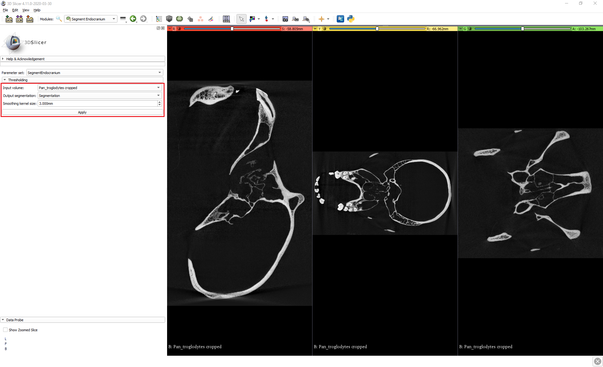

4.	Click *Apply*. Depending on your computer and the smoothing kernel size that was used, after a few minutes you should have a virtual endocast.

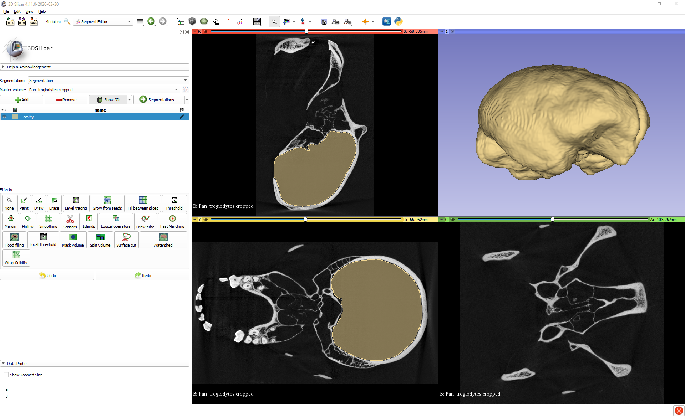

## Comparison of methods
As I said at the beginning, I have presented multiple methods here to give you different options and showcase different approaches that might give you ideas for how to tackle your own cavity segmentation tasks. As some additional information to help you decide which method you might want to pursue, here’s a comparison of the different methods’ end products.

 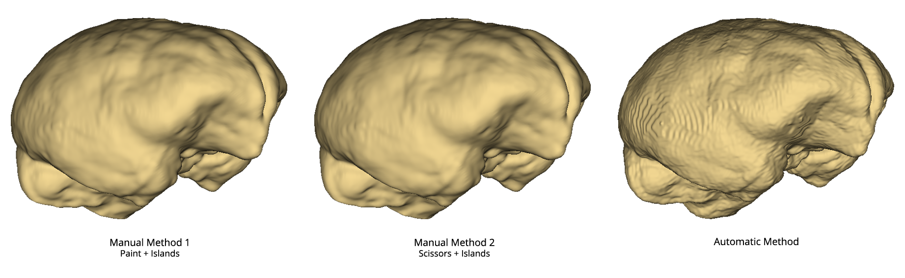

You can see that as long as the two manual methods are applied carefully and consistently (e.g. ensuring that the foramen magnum is always crossed at the same point) then the endocasts produced by them are practically identical. On the other hand, the endocast produced by the automatic method is noticeably different from those created by the manual methods.

We can investigate this difference using another extension to 3D Slicer called **Model To Model Distance**. If we convert the endocast segments produced by the different methods to 3D models, then we can use this module to visualise the pairwise differences between them. By default, the **Model To Model Distance** module highlights any comparative additions between models in green and any comparative losses in red, while a lack of difference is indicated with grey.

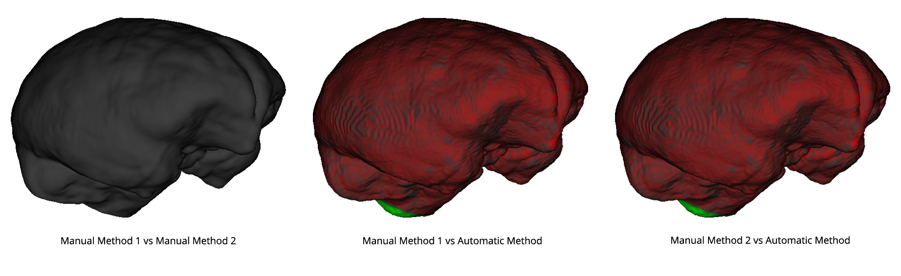

We can see that the endocast produced by the automatic method is slightly smaller than those produced by the manual methods, though it does show a comparative addition around the foramen magnum due to leakage out being less controlled in this method (though any leakage can of course be removed manually afterwards).

We can verify the overall size differences between methods by calculating the volumes of the different endocasts using the **Segment Statistics** module that’s part of base 3D slicer. This tool tells us that the endocasts produced by both Manual Method 1 and Manual Method 2 have the exact same volume of 319.8 cm3, while the endocast from the automatic method has a volume of 314.7 cm3. These differences between the methods are worth bearing in mind and perhaps further evaluating, especially if you were considering using them in a research context.

However, although inter-method reliability may be something to consider, we can be confident that all the methods have good validity, as all the volumes of the endocasts produced by the methods fall right within the known natural variation of chimpanzee brain size. Isler et al. (2008) (https://doi.org/10/bxv9mr) gathered measurements of chimpanzee brain size the traditional way by filling the cranial cavities of museum specimens with seed, sand, or glass beads, and then converting the weight of these into volume measurements, and from a sample of 115 specimens arrived at a mean brain size for chimpanzees of 368 cm3, with a range from 282-480 cm3.

